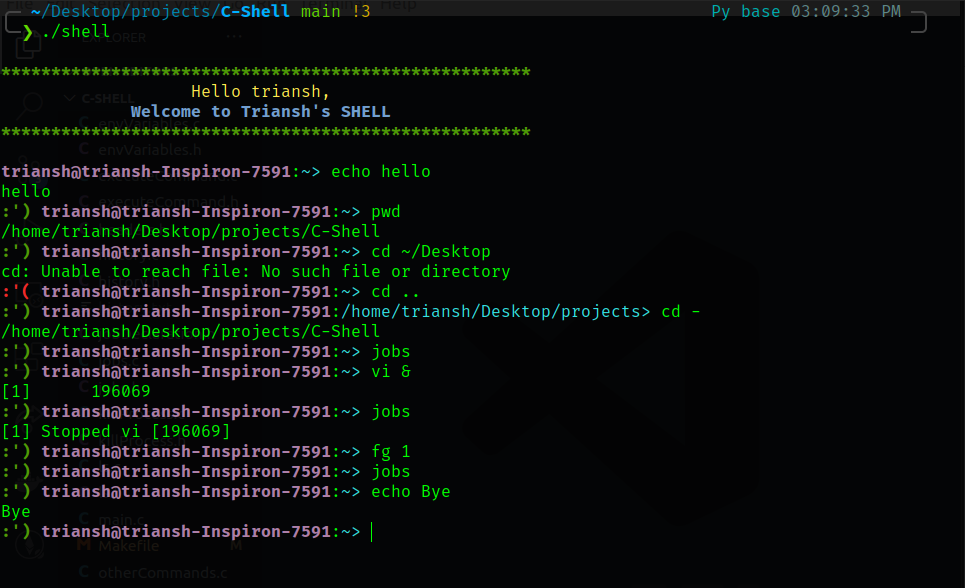

# C-Shell

## Overview

This is a custom shell made in C. I tried to implement as many features as possible. Hope you like it.




The below points describe which file contains what type of functionality.

### Installation

Before running the below commands, make sure you have
* GCC compiler
* Linux OS (prefereably Ubuntu)

Run the following commands to start the shell.

```shell
$ make
$ ./shell
```


### Functionality

1. `main.c`
    
    This contains the main function of the program. The main function includes the primary shell-loop of the program and is responsible for executing other commands.

2. `prompt.c`
 
    This file is responsible for implementing and printing the prompt of the shell. It also extracts the input and parse into commands broken by a semi-colon.

3. `executeCommand.c`
    
    This file is responsible for handling redirection and piping.

4. `stringTokenize.c`  

    This contains the function parseString to break the strings with delimiters into respective arguments/commands.

5. `cd.c` 
    
    This is responsible for implementing 'cd' functionality.

6. `echo.c` 
    
    This is responsible for implementing 'echo' functionality.

7. `pwd.c` 
    
    This is responsible for implementing 'pwd' functionality.

8. `ls.c` 
    
    This is responsible for implementing 'ls' functionality.

9. `history.c` 

    This is responsible for implementing 'history' functionality.

10. `pinfo.c` 
    
    This is responsible for implementing 'pinfo' functionality which basically describes the information regarding a process.

11. `otherCommands.c` 
    
    This file is responsible for implementing foreground and background processes using the execvp command by forking the parent process. It includes the functions for implementing the above.

12. `jobs.c`
    
    For checking the status of a background process (whether exited or not), this file uses functions that store the PID and command name of the process in an array jobList. It implements the functionality of adding and removing background processes in the jobList Array.

13. `changeProcessGroup.c` 
    
    This file is responsible for performing fg and bg command.

14. `commandList.c` 
    
    This file contains the conditional branch for selecting which command has to be executed.

15. `killProcess.c` 
    
    This file is responsible for performing kjob and overkill both of which are used to kill processes.

13. `jobDeclaration.h` 
    
    This header describes the structure job for implementing the functionality in jobs.c

14. `headers.h` 
    
    This includes all the header files used from C Library and some constant variables (#define). It also describes the colors used in this assignment.

15. `history.txt` 
    
    This file stores the history of commands ran on the shell.

### Assumptions
   
1. The total no. of commands separated by semi-colon are atmost 100.

2. The length of each command is atmost 1024.

3. The total no. of background processes at any instance are atmost 50.

 
